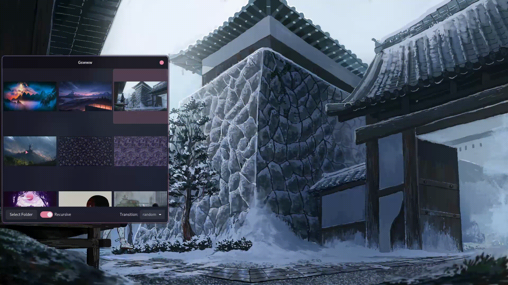

# a Graphical Solution to your Wayland Wallpaper Woes
### ⚠️ It's usable, but expect some major changes⚠️




## Dependencies
+ [swww](https://github.com/Horus645/swww)
+ GTK4
+ Up to date rustc compiler and cargo
+ webp-pixbuf-loader (optional: to view .webp images)

## Installion
To build, clone this repo:
```
git clone https://github.com/Dwogo/Gswww.git && cd Gswww/
```
and inside run:
```
cargo build --release
```

Then put `./target/release/`  into your path,
and copy: 
+ `Gswww.desktop` to `~/.local/share/applications/`
+ `Gswww.png` to `~/.icons/`

Voilà, now you can graphically change your wallpaper using the awesome swww deamon.
Just select the folder that holds your wallpapers, and click on the previews.

**Just make sure you actually have the daemon running otherwise it's not going to work** 

## Features of swww (The daemon)
+ Display animated gifs as your wallpaper
+ Display images in any format (Some of these I didn't know existed)
    + jpeg
    + png
    + gif
    + tga
    + tiff
    + webp
    + pnm
    + bmp
    + farbfeld (Not included in Gswww)
+ Clear the screen with a rrggbb colour
+ Smooth transition effect when you switch images
+ Doing it all without having to pkill the daemon

## Big Thanks
Thanks goes to [Horus645](https://github.com/Horus645) for making [swww](https://github.com/Horus645/swww)